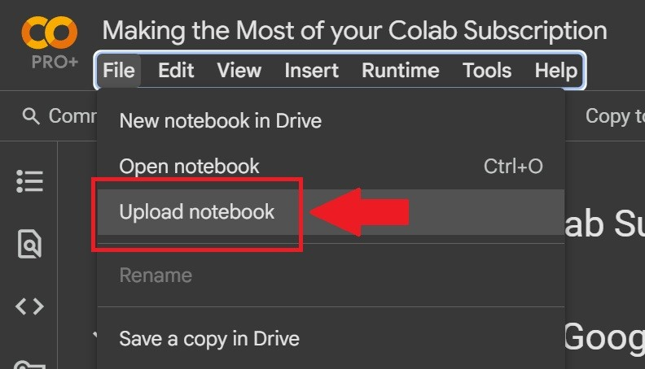

### Reproducing Figures from Our Paper

This repository provides Jupyter notebooks and instructions for easily reproducing the figures from our paper using Google Colab. To reproduce a figure, click the link below and download the file:

* [Figure 4](Griewank.ipynb)
* [Figure 5](Dropwave.ipynb)
* [Figure 6](Levy4.ipynb)
* [Figure 7](Ackley5.ipynb)
* [Figure 8](Hartmann6.ipynb)

To download a file on GitHub, click the button shown below.

---

### Getting Started with Google Colab

First, you'll need to upload the downloaded `.ipynb` file to Google Colab.

Because some of the competing methods require significant memory, please switch your runtime to **High-RAM** to avoid memory errors. While this feature is typically available with a Colab Pro subscription, it is **free for all users with an `.edu` email account**.

---

### Running the Notebook

After you've uploaded the notebook and configured your runtime, simply click **Run All** button shown below.

When prompted, select **"Connect to Google Drive"**. This step is crucial, as it allows the notebook to save intermediate outputs to your Google Drive.

---

### How the Notebook Works

The notebook is designed to be user-friendly and resilient:

1.  The first cell connects to your **Google Drive** to save intermediate outputs. This allows you to resume your work if the Colab runtime is interrupted.
2.  The second cell installs any necessary **packages** that aren't included by default in Google Colab.
3.  The third cell downloads all the required **methods** from this repository.
4.  The fourth cell runs all the benchmark methods. The details of these methods can be found in our paper. The notebook automatically skips any methods that have already been completed in a previous run, saving you time if the runtime was interrupted.
5.  The final cell retrieves all the intermediate data to generate and plot the two final figures: one for **cumulative regret** and another for **cumulative movement costs**.

---

### Troubleshooting

If your runtime is ever terminated unexpectedly and is unfinished, just reload the page and click **Run All** again. The notebook will automatically skip the completed steps and pick up where it left off. Once all the cells have finished, your two figures will appear in the output of the last cell!

